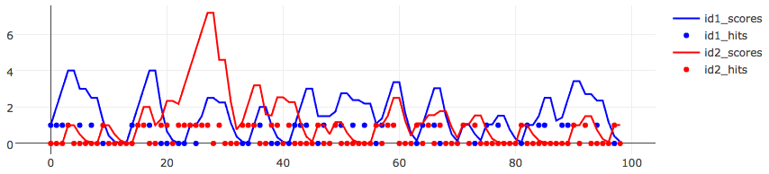
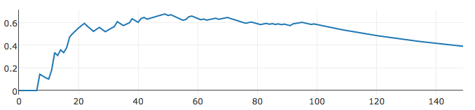
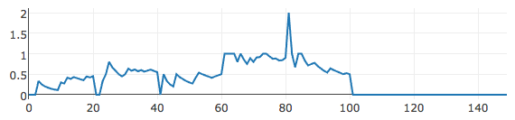

=================
 README Trending
=================

Instead of a "popularity" based on absolute hit count, I want to come
up with a "score" that indicates if a thing is "trending".  Things
that are more being hit recently should be trending more than things
that haven't been hit recently.

We don't want to store each hit and timestamp -- the classical pattern
-- due to excessive data. Can we use some simple math to calculate
trending scores -- or more accurately -- an age-weighted hit count?

My thinking is that we store the "score" which is basically a running
hit-count that's been derated by the age of the count, along with the
last time the score was updated. Then when we get a new hit, we
subtract last time from current time, multiple the old score by that
(to derate) then add "1" for the new count.

Here's a simulation of two items which are hit about a third of the
time, over 100 intervals.

I've reworked the code to calculate a "velocity" from current minus
old hits divided by current minus old times. It seems more smooth. At
100, I stop adding hits and we see the velocity decay slowly.

But if I age out old values, replacing with the only thing I have --
the previous ones -- then I get spiky valuse. In this, we age every 20
intervals.

